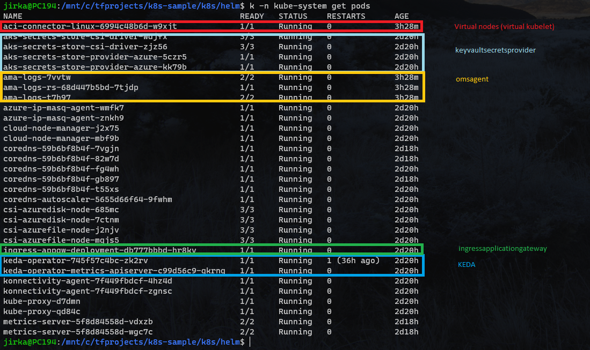
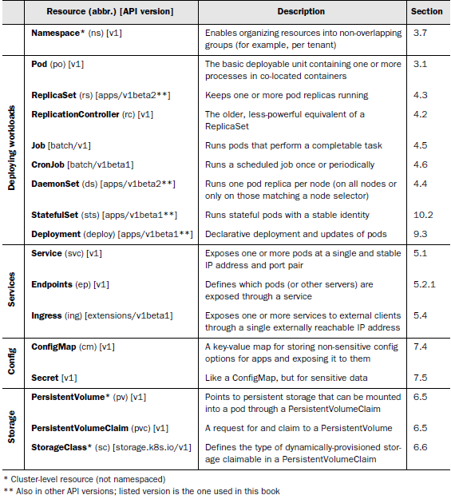
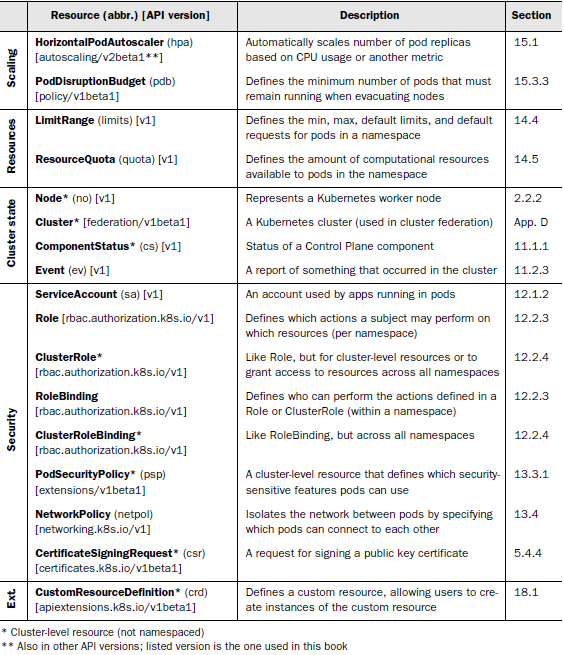
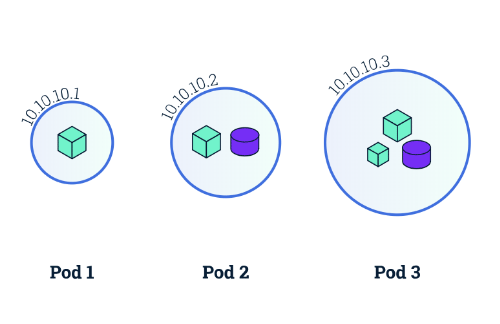
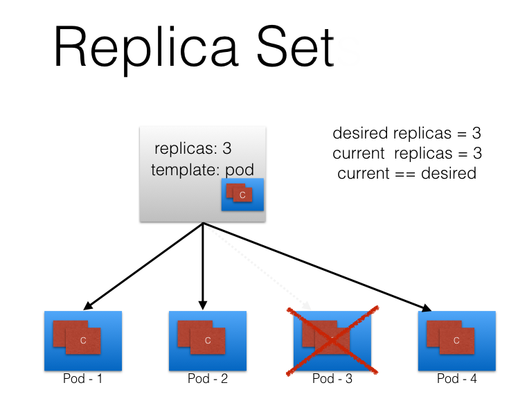
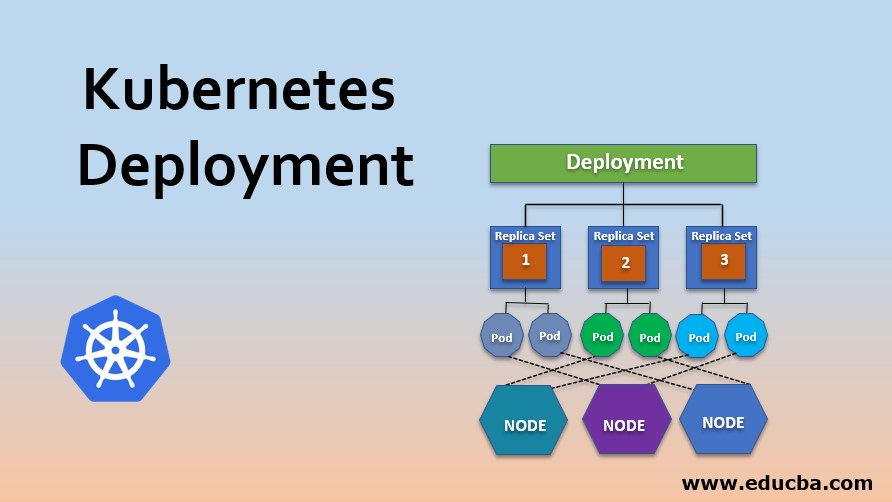
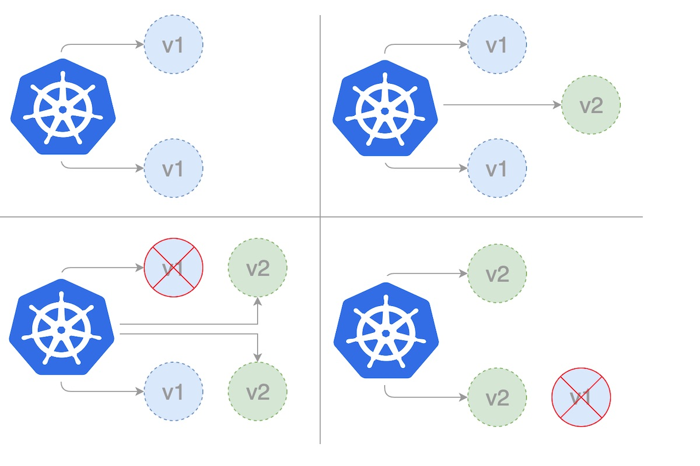
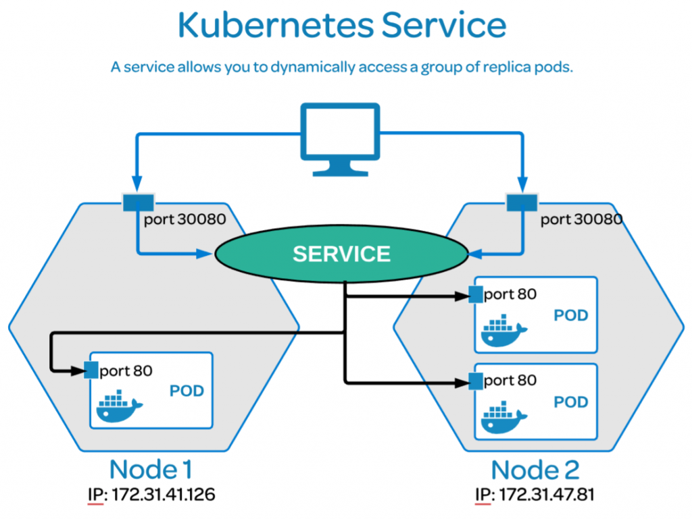
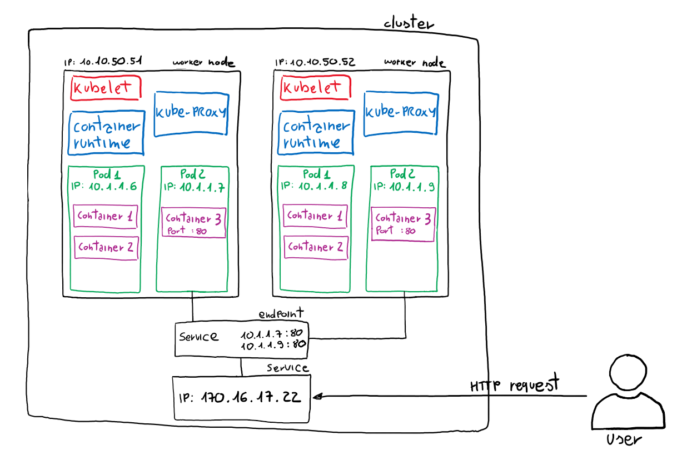
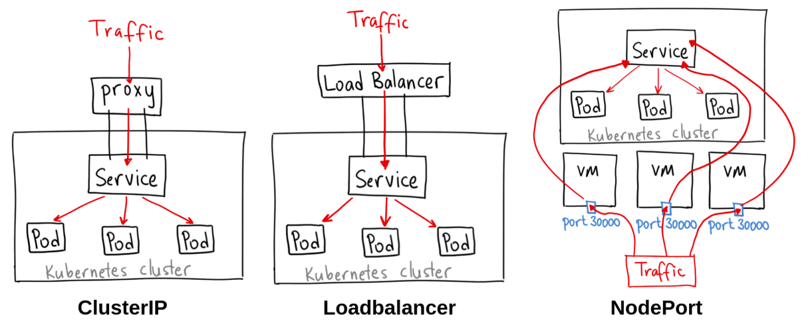

# Prepare Linux environment with Azure CLI, kubectl and helm (with autocompletion)

## Install Ubuntu through WSL2

-   Ensure you have [WSL2 support](https://www.sitepoint.com/wsl2/)
-   Install `Windows Terminal Preview` through `Windows Store`
-   Install `Ubuntu` through `Windows Store`
-   Verify it's there and running

    ```bash
    $> wsl --list --verbose
      NAME                   STATE           VERSION
    * Ubuntu                 Running         2
      docker-desktop-data    Running         2
      docker-desktop         Running         2
    ```

-   You can open linux terminal through the `Windows Terminal` (`C:\` drive is automatically mounted under `/mnt/c/`)

## Install Azure CLI

-   https://learn.microsoft.com/en-us/cli/azure/install-azure-cli-linux?pivots=apt
    ```bash
    curl -sL https://aka.ms/InstallAzureCLIDeb | sudo bash
    ```
-   Login
    ```bash
    az login
    ```
-   Select active subscription
    ```bash
    az account set --subscription <subscription-id>
    az account show
    ```

## Install Kubectl with autocompletion

-   https://kubernetes.io/docs/tasks/tools/install-kubectl-linux/
    ```bash
    sudo apt-get update
    sudo apt-get install -y ca-certificates curl
    sudo curl -fsSLo /usr/share/keyrings/kubernetes-archive-keyring.gpg https://packages.cloud.google.com/apt/doc/apt-key.gpg
    echo "deb [signed-by=/usr/share/keyrings/kubernetes-archive-keyring.gpg] https://apt.kubernetes.io/ kubernetes-xenial main" | sudo tee /etc/apt/sources.list.d/kubernetes.list
    sudo apt-get update
    sudo apt-get install -y kubectl
    ```
-   https://kubernetes.io/docs/tasks/tools/included/optional-kubectl-configs-bash-linux/
    ```bash
    echo '' >>~/.bashrc
    echo '# kubectl bash completion' >>~/.bashrc
    echo 'source <(kubectl completion bash)' >>~/.bashrc
    echo 'alias k=kubectl' >>~/.bashrc
    echo 'complete -o default -F __start_kubectl k' >>~/.bashrc
    ```

## Install Helm with autocompletion

-   https://helm.sh/docs/intro/install/
    ```bash
    curl https://baltocdn.com/helm/signing.asc | gpg --dearmor | sudo tee /usr/share/keyrings/helm.gpg > /dev/null
    sudo apt-get install apt-transport-https --yes
    echo "deb [arch=$(dpkg --print-architecture) signed-by=/usr/share/keyrings/helm.gpg] https://baltocdn.com/helm/stable/debian/ all main" | sudo tee /etc/apt/sources.list.d/helm-stable-debian.list
    sudo apt-get update
    sudo apt-get install helm
    ```
-   https://helm.sh/docs/helm/helm_completion_bash/
    ```bash
    echo '' >>~/.bashrc
    echo '# helm bash completion' >>~/.bashrc
    echo 'source <(helm completion bash)' >>~/.bashrc
    echo 'alias h=helm' >>~/.bashrc
    echo 'complete -o default -F __start_helm h' >>~/.bashrc
    ```

# 1. Prepare AKS (with bicep templates)

-   Sample deployment contains:

    -   Azure Container Registry
    -   Azure Application Gateway
    -   Azure KeyVault
    -   Azure AppInsights
    -   Azure LogAnalytics / ContainerInsights
    -   Azure Container Service with [add-ons](https://learn.microsoft.com/en-us/azure/aks/integrations#available-add-ons):
        -   Virtual nodes (virtual kubelet)
        -   Container insights
        -   [Azure KeyVault secrets provider](https://secrets-store-csi-driver.sigs.k8s.io/introduction.html)
        -   [Application Gateway Ingress Controller](https://azure.github.io/application-gateway-kubernetes-ingress/)
        -   [Kubernetes Event Driven Autoscaler (KEDA)](https://keda.sh/docs/2.8/scalers/)
        -   [Cert-Manager](https://cert-manager.io/docs/installation/helm/) (installed through `helm`)
        

-   Some possibly usefull bicep related links:

    -   [Microsoft.ContainerService/managedClusters](https://learn.microsoft.com/en-us/azure/templates/microsoft.containerservice/managedclusters?pivots=deployment-language-bicep)
    -   [Microsoft.Network/applicationGateways](https://learn.microsoft.com/en-us/azure/web-application-firewall/ag/quick-create-bicep?tabs=CLI)

-   We have to ensure the subscription has enabled features/providers we need (otherwise the deployment would fail):
    ```bash
    az provider register --namespace Microsoft.ContainerService --wait
    az provider register --namespace Microsoft.ContainerInstance --wait
    az provider register --namespace Microsoft.OperationsManagement --wait
    az feature register --name AKS-KedaPreview --namespace Microsoft.ContainerService --wait
    ```
-   Trigger the deployment
    ```bash
    az deployment sub create --name samplek8s --location westeurope --template-file resourceGroup.bicep --parameters parameters.json
    ```
-   Get access to the cluster
    ```bash
    az aks get-credentials -g samplek8s -n akssamplek8s --context sample
    ```
-   Verify its ready by listing the nodes (you should see one system node, one user node and one virtual node)

    ```bash
    $> k get nodes
    NAME                            STATUS   ROLES   AGE      VERSION
    aks-lin-39240155-vmss000000     Ready    agent   44d      v1.24.6
    aks-sys-28158514-vmss000000     Ready    agent   44d      v1.24.6
    virtual-node-aci-linux          Ready    agent   2y125d   v1.19.10-vk-azure-aci-
    ```

-   Install cert manager with helm

    ```
    helm repo add jetstack https://charts.jetstack.io
    helm repo update
    helm install cert-manager jetstack/cert-manager \
        --namespace cert-manager \
        --create-namespace
        --set nodeSelector."kubernetes\.io/os"=linux \
        --set webhook.nodeSelector."kubernetes\.io/os"=linux \
        --set cainjector.nodeSelector."kubernetes\.io/os"=linux \
        --set ingressShim.defaultIssuerName=letsencrypt \
        --set ingressShim.defaultIssuerKind=ClusterIssuer \
        --set installCRDs=true
    ```

-   Configure LetsEncrypt providers

    ```bash
    k -n cert-manager apply -f letsencrypt-clusterissuer-staging.yml
    k -n cert-manager apply -f letsencrypt-clusterissuer-prod.yml
    ```

# 2. Prepare DNS entries for public load balancer

-   Register some free domain e.g. on [Freenom](https://my.freenom.com/clientarea.php)
-   Find AppGW public IP:
    ```bash
    az network public-ip show -n publicipappgwsamplek8s -g samplek8s --query ipAddress -o tsv
    ```
-   Register a DNS entry for this domain
-   Wait untill available

    ```cmd
    $> nslookup k8s-sample.ga
    Server:  PDC3.win.ips-ag.net
    Address:  192.168.12.231

    Non-authoritative answer:
    Name:    k8s-sample.ga
    Address:  40.115.39.191
    ```

# 3. Install Docker for windows

-   https://docs.docker.com/desktop/install/windows-install/
-   Ensure you're switched to Linux containers
-   Allow the Ubuntu using docker on the hosting system (Docker Desktop -> Resources -> WSL Integration -> Enable integration with additional distros: Ubuntu)

# 4. Prepare test application

## Source

-   There is simple Net6 web application with swagger in `src` folder

## Build and publish docker image

-   Navigate to `src\TestApp\TestApp\` and build the docker image with
    ```bash
    docker build . -t acrsamplek8s.azurecr.io/testapp
    ```
-   Get login user & password for ACR:

    ```bash
    NAME=acrsamplek8s
    RG=samplek8s
    USERNAME=$(az acr credential show --name $NAME --resource-group $RG --query username -o tsv)
    PASSWORD=$(az acr credential show --name $NAME --resource-group $RG --query passwords[0].value -o tsv)
    ```

-   Login
    ```bash
    echo $PASSWORD | docker login $NAME.azurecr.io -u $USERNAME --password-stdin
    ```
-   Push the image
    ```bash
    docker push acrsamplek8s.azurecr.io/testapp
    ```

# 5. Kubernetes concepts

## Overview




## Namespace

Enables organizing resources into non-overlaping groups (for example, per tenant).


```bash
k create namespace testapp
k apply -n testapp -f 1-pod.yaml
k delete namespace testapp
```

## Pod

The basic deployable unit containing one or more processes in co-located containers.
https://kubernetes.io/docs/concepts/workloads/pods/pod-lifecycle/



```bash
k apply -f 1-pod.yml
k get pods
k port-forward pod/testapp 8080:80
k delete pod testapp
k get pods
```

## ReplicaSet

Keeps one or more pod replicas running.
https://kubernetes.io/docs/concepts/workloads/controllers/replicaset/



```bash
k apply -f 2-replicaset.yml
k get pods
k delete pod testapp-jhgg7
k get pods
k delete -f 2-replicaset.yml
```

## Deployment

Declarative deployment and updates of pods (can be scaled).
https://kubernetes.io/docs/concepts/workloads/controllers/deployment/


```bash
k apply -f 3-teployment.yml
k get pods
k scale deployment testapp --replicas=2
k get pods
k scale deployment testapp --replicas=1
k get pods
```

Rolling update:



```bash
k apply -f 3-deployment.yml
k get pods
k describe pod testapp-6977dd6889-pzswt
k delete -f 3-deployment.yml
```

## Service

Exposes one or more pods at a single and stable IP address and port pair.
Defined trough endpoints selected by labels.
https://kubernetes.io/docs/concepts/services-networking/service/



```bash
k apply -f 4-service.yml
k get pods
k get services
k port-forward service/testapp 8080:80
k describe service testapp
k describe pod testapp
k delete -f 4-service.yml
```

-   ClusterIp, NodePort, LoadBalancer
    

## Ingress

Exposes one or more services to external clients through a single externally reachable IP address.
https://kubernetes.io/docs/concepts/services-networking/ingress/


```bash
k apply -f 5-ingress.yml
https://k8s-sample.ga/swagger/index.html (appgw configured / ssl certificate obtained automatically)
k delete -f 5-ingress.yml
```

```yaml
apiVersion: networking.k8s.io/v1
kind: Ingress
metadata:
    name: testapp
    annotations:
        kubernetes.io/ingress.class: azure/application-gateway
        cert-manager.io/cluster-issuer: letsencrypt-prod
        cert-manager.io/acme-challenge-type: http01
spec:
    tls:
        - hosts:
              - k8s-sample.ga
          secretName: k8s-sample-ga-tls
    rules:
        - host: k8s-sample.ga
          http:
              paths:
                  - path: "/"
                    pathType: Prefix
                    backend:
                        service:
                            name: testapp
                            port:
                                number: 80
```

## ConfigMap

A key-value map for storing non-sensitive config options for apps and exposing it to them.
https://kubernetes.io/docs/concepts/configuration/configmap/

```yaml
apiVersion: v1
kind: ConfigMap
metadata:
    name: testapp-configmap
    labels:
        app: testapp
data:
    ASPNETCORE_ENVIRONMENT: "Production"
```

```yaml
    env:
        - name: ASPNETCORE_ENVIRONMENT
        valueFrom:
            configMapKeyRef:
                name: testapp-configmap
                key: ASPNETCORE_ENVIRONMENT
```

## Secret

Like a ConfigMap, but for sensitive data.
https://kubernetes.io/docs/concepts/configuration/secret/

```yaml
apiVersion: v1
kind: Secret
metadata:
    name: testapp-secret
    labels:
        app: testapp
stringData:
    APPINSIGHTS_INSTRUMENTATIONKEY: "5a6b99af-cd82-4ae1-b319-bc2a4d19ad11"
```

```yaml
    env:
        - name: APPINSIGHTS_INSTRUMENTATIONKEY
        valueFrom:
            secretKeyRef:
                name: testapp-secret
                key: APPINSIGHTS_INSTRUMENTATIONKEY
```

## HorizontalPodAutoscaler

Automatically scales number of pod replicas based on CPU usage or another metric.
https://kubernetes.io/docs/tasks/run-application/horizontal-pod-autoscale/

```yaml
apiVersion: autoscaling/v2
kind: HorizontalPodAutoscaler
metadata:
    name: testapp
spec:
    scaleTargetRef:
        apiVersion: apps/v1
        kind: Deployment
        name: testapp
    minReplicas: 1
    maxReplicas: 3
    metrics:
        - type: Resource
          resource:
              name: cpu
              target:
                  type: Utilization
                  averageUtilization: 60
```

```bash
k apply -f 6-hpa.yml
k run -i --tty load-generator --rm --image=busybox:1.28 --restart=Never -- /bin/sh -c "while sleep 0.001; do wget -q -O- http://testapp/version; done"
k get hpa testapp --watch
k delete -f 6-hpa.yml
```

## PersistentVolumeClaim

A request for and claim to a PersistentVolume (persistent storage that can be mounted into a pod).
https://kubernetes.io/docs/concepts/storage/persistent-volumes/

```yaml
apiVersion: v1
kind: PersistentVolumeClaim
metadata:
    name: testapp
    labels:
        app: testapp
spec:
    accessModes:
        - ReadWriteOnce
    resources:
        requests:
            storage: 10Gi
```

## Job

Runs pods that perform a completable task.
https://kubernetes.io/docs/concepts/workloads/controllers/job/

```bash
apiVersion: batch/v1
kind: Job
metadata:
  name: pi
spec:
  template:
    spec:
      containers:
      - name: pi
        image: perl:5.34.0
        command: ["perl",  "-Mbignum=bpi", "-wle", "print bpi(2000)"]
      restartPolicy: Never
  backoffLimit: 4
```

## CronJob

Runs a scheduled job once or periodically.
https://kubernetes.io/docs/concepts/workloads/controllers/cron-jobs/

```bash
apiVersion: batch/v1
kind: CronJob
metadata:
  name: hello
spec:
  schedule: "* * * * *"
  jobTemplate:
    spec:
      template:
        spec:
          containers:
          - name: hello
            image: busybox:1.28
            imagePullPolicy: IfNotPresent
            command:
            - /bin/sh
            - -c
            - date; echo Hello from the Kubernetes cluster
          restartPolicy: OnFailure
```

# 6. KeyVault provider

```bash
az aks show -g samplek8s -n akssamplek8s --query addonProfiles.azurekeyvaultsecretsprovider.identity.clientId -o tsv
k apply -f keyvault-secrets-provider.yml
k apply -f 7-keyvault.yml
```

```yaml
    containers:
            ...
            volumeMounts:
                - name: keyvault-secrets
                mountPath: "/mnt/keyvault-secrets"
                readOnly: true
    volumes:
        - name: keyvault-secrets
            csi:
                driver: secrets-store.csi.k8s.io
                readOnly: true
                volumeAttributes:
                    secretProviderClass: "keyvault-secrets-provider"
```

# 7. ACI (Azure container instances)

```yaml
nodeSelector:
    kubernetes.io/role: agent
    beta.kubernetes.io/os: linux
    type: virtual-kubelet
tolerations:
    - key: virtual-kubelet.io/provider
      operator: Exists
    - key: azure.com/aci
      effect: NoSchedule
```

```bash
NAME=acrsamplek8s
RG=samplek8s
USERNAME=$(az acr credential show --name $NAME --resource-group $RG --query username -o tsv)
PASSWORD=$(az acr credential show --name $NAME --resource-group $RG --query passwords[0].value -o tsv)
kubectl create secret docker-registry regcred --docker-server=$NAME.azurecr.io --docker-username=$USERNAME --docker-password=$PASSWORD
```

```bash
k apply -f keyvault-secrets-provider-aci.yml
k apply -f testapp-aci-secrets.yml
k apply -f testapp-aci.yml
https://k8s-sample.ga/aci/swagger/index.html
```

-   [Limitations](https://learn.microsoft.com/en-us/azure/aks/virtual-nodes#known-limitations):
    -   can't use managed identity for accessing ACR => workaround with special secret needed
    -   can't simply attach CSI driver for secrets => workaround with exposing as k8s secret and additional container mounting it needed

# 8. KEDA (Kuberntes Event Driven Autoscaler)

-   https://keda.sh/docs/2.8/concepts/scaling-deployments/
-   https://keda.sh/docs/2.8/scalers/
-   https://keda.sh/docs/2.8/authentication-providers/

# 9. Helm

| Question             | Answer                                                                                                                                                                                                                                                                                                                                                                                                                                                                                                                                                                                                                                                                                                                                                                             |
| -------------------- | ---------------------------------------------------------------------------------------------------------------------------------------------------------------------------------------------------------------------------------------------------------------------------------------------------------------------------------------------------------------------------------------------------------------------------------------------------------------------------------------------------------------------------------------------------------------------------------------------------------------------------------------------------------------------------------------------------------------------------------------------------------------------------------- |
| What Is Helm?        | Helm is a tool to help you define, install, and upgrade applications running on Kubernetes. At its most basic, Helm is a templating engine that creates Kubernetes manifests. What makes Helm more than that is it can upgrade and scale applications as well.                                                                                                                                                                                                                                                                                                                                                                                                                                                                                                                     |
| Why Is It Important? | Helm reduces the amount of work you need to do to deploy, upgrade, and manage an application to Kubernetes. This helps limit human error and also creates a more declarative configuration to enable workflows like GitOps. This capability really stands out when you have a large, complex application; your app may contain dozens of Kubernetes objects that need to be configured and changed during upgrades. It also applies if you’re deploying the same app multiple times. Using find-and-replace in multiple manifests is a recipe for disaster. Helm can make the process easy and repeatable. It’s why an instance of a chart running on a Kubernetes cluster is called a release. If you need three different installs of a web server, each one is its own release. |

## Create helm chart for our application

-   Create helm chart:

    -   Generate skeleton
        ```bash
        helm create testapp
        ```
    -   Adjust the templates & `chart.yaml`/`values.yaml`
    -   Test it with generating the final k8s resources with:
        ```bash
        helm template testapp testapp/ -f testapp/values.yaml --output-dir testapp-manifest/
        ```

-   Install

    ```bash
    helm install testapp testapp/ --values testapp/values.yaml
    helm ls
    NAME    NAMESPACE       REVISION        UPDATED                                 STATUS          CHART           APP VERSION
    testapp default         0               2022-11-28 11:00:18.4492559 +0100 CET   deployed        testapp-0.1.0   1.1
    ```

-   Upgrade

    ```bash
    helm upgrade testapp testapp/ --values testapp/values.yaml
    helm ls
    NAME NAMESPACE REVISION UPDATED STATUS CHART APP VERSION
    testapp default 1 2022-11-28 11:00:18.4492559 +0100 CET deployed testapp-0.1.0 2.0
    ```

-   Rollback

    ```bash
    helm rollback testapp 0 (=REVISION)
    helm ls
    NAME NAMESPACE REVISION UPDATED STATUS CHART APP VERSION
    testapp default 0 2022-11-28 11:00:18.4492559 +0100 CET deployed testapp-0.1.0 1.1
    ```

-   Uninstall

    ```bash
    helm uninstall testapp
    ```
